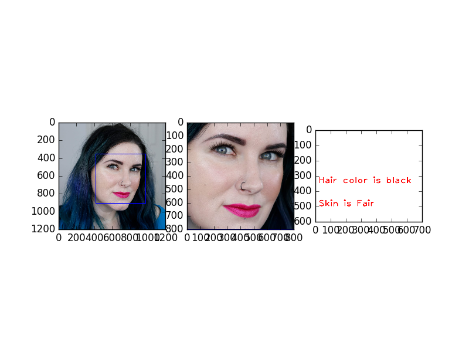

SKIN COLOR AND HAIR COLOR DETECTION USING DEEP LEARNING, IMAGE PROCESSING AND MACHINE LEARNING.

Environment:
Ubuntu 16.04 LTS
Ram 8GB
Intel® Core™ i5-7200U CPU @ 2.50GHz × 4 

Framework : Pytorch
Face detection : dlib

No of classes for skin color 
1- White
2- Brown
3- Black

No of classes for Hair color
1- Black
2- Grey
3- Blonde

#Note - Hair model is confused between grey and blonde color [have some ideas for better classification between them]
 
Steps to run the code.
2- Create a Virtual environment in ubuntu.
[sudo apt-get install virtualenv]
#check the steps for creating and activating the virtual env

1- Install the requirement.txt in that virtual env. [pip3 install -r requirement.txt]
2- Put your test images into #test folder
3- Run the code [python3 submit_code.py]
4- Check the prediction in output folder.

#Note - Due of less time and less data accuracy is not that much good but there are lots of areas for improvement.

#Gaurav kothyari
#https://github.com/gkothari25
#gkothari25@gmail.com 
